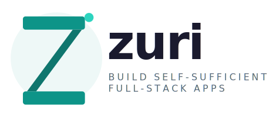

<div align="center">
  <picture>
    <source media="(prefers-color-scheme: dark)" srcset="./zuri-dark.svg">
    <source media="(prefers-color-scheme: light)" srcset="./zuri-light.svg">
    
  </picture>

[//]: # (  <h1>Zuri</h1>)

  <p><strong>The self-sufficient full-stack language.</strong><br>
  Build complete, production-ready full-stack services with nothing but Zuri —<br>
  no framework hunting, no dependency hell, no third-party registry anxiety.</p>

[](https://github.com/zuri-lang/zuri/actions)
[](https://github.com/zuri-lang/zuri/blob/master/LICENSE)
[](https://github.com/zuri-lang/zuri)
[](https://gitter.im/zuri-lang/community)

[Try Zuri Online](#) &nbsp;·&nbsp; [Documentation](#) &nbsp;·&nbsp; [Tutorial](#) &nbsp;·&nbsp; [Community](#)
</div>

---

## Everything you need is already here

Most full-stack languages make you assemble a stack from dozens of third-party packages before you can do anything useful. Zuri takes a different philosophy: **the tools you need to build real full-stack services ship with the language itself.**

HTTP server. Routing. Database. Template engine. Mail. Cryptography. Image processing. A self-hostable private package registry. All built in. No installs required.

```zuri
import http
import sqlite
import hash

var db = sqlite.open('app.db')
var server = http.server(3000)

server.handle('POST', '/users', @(req, res) {
  var password_hash = hash.sha256(req.body.password)
  db.exec('INSERT INTO users (email, password) VALUES (?, ?)',
    [req.body.email, password_hash])
  res.json({ status: 'created' })
})

echo 'API running on port 3000...'
server.listen()
```

That's a working API endpoint — with a real database and password hashing — in 13 lines. No `pip install`, no `npm install`, no `composer require`. Just Zuri.

---

## Why Zuri

### The dependency problem is real

Modern full-stack development has a dependency problem. A simple Node.js project can pull in hundreds of packages just to serve HTTP requests. Every package is a potential security vulnerability, a breaking change waiting to happen, a maintainer who might abandon their work. The ecosystem becomes fragile, and you spend more time managing dependencies than building your product.

Zuri was designed from the ground up to eliminate this problem. The standard library covers the full surface area of typical full-stack development, so you reach for a third-party package only when you're doing something genuinely unusual — not to serve a web request.

### Own your infrastructure completely

Zuri ships with **Nyssa** — a package manager *and* a self-hostable private package registry in one. Your team can run its own registry on your own servers. No dependence on a central public registry. No exposure of proprietary internal packages. Full control over what code enters your supply chain.

```sh
# Install a package
nyssa install package-name

# Publish to your own private registry
nyssa publish --registry https://packages.yourcompany.com

# Run your own registry server
nyssa serve

# Distribute your app as a single runnable unit for Linux, Windows, and MacOS.
nyssa bundle
```

This makes Zuri especially compelling for organizations with strict data sovereignty requirements, regulated industries, and teams that have been burned by public registry outages or supply chain attacks.

---

## What's built in

Zuri's standard library covers everything a full-stack needs — production-ready, maintained as part of the language itself.

| Capability                | Module           | Status     |
|---------------------------|------------------|------------|
| HTTP server & client      | `http`           | ✅ Ready    |
| Sockets                   | `socket`         | ✅ Ready    |
| WebSockets                | `websocket`      | 🔜 Planned |
| SQLite database           | `sqlite`         | ✅ Ready    |
| SSL / TLS                 | `ssl`            | ✅ Ready    |
| Cryptography & Hashing    | `hash`, `crypto` | ✅ Ready    |
| HTML templating (Wire)    | `template`       | ✅ Ready    |
| HTML parsing & generation | `html`           | ✅ Ready    |
| Markdown processing       | `markdown`       | ✅ Ready    |
| Mail (SMTP, IMAP, POP3)   | `mail`           | ✅ Ready    |
| Image processing          | `imagine`        | ✅ Ready    |
| JSON                      | `json`           | ✅ Ready    |
| File                      | `file`           | ✅ Ready    |
| Input & Output (I/O)      | `io`             | ✅ Ready    |
| HTTP compression          | `zlib`           | ✅ Ready    |
| AST & metaprogramming     | `ast`            | ✅ Ready    |
| Unit testing              | `test`           | ✅ Ready    |
| URL / cURL bindings       | `url`, `curl`    | ✅ Ready    |
| FFI/C interop             | `clib`           | ✅ Ready    |
| Device I/O (COM, USB)     | `device`         | 🔜 Planned |
| ORM                       | `orm`            | 🔜 Planned |
| Audio / Video processing  | `media`          | 🔜 Planned |

---

## A taste of what Zuri looks like

**Full-stack HTML server with Wire templates**

```zuri
import http
import template

var server = http.server(8080)

server.handle('GET', '/', @(req, res) {
  res.write(template.render('index', {
    title: 'Welcome to Zuri',
    user: req.session.get('user')
  }))
})

server.listen()
```

**Sending mail**

```zuri
import mail

var msg = mail.Message()
    .from('someone@example.com')
    .to('hello@domain.com')
    .subject('Hello, World')
    .text('Welcome to Zuri Mail!')

var mailer = mail.smtp('smtp.yourhost.com', 587)
    .auth('user@yourhost.com', 'password')
    .add_message(msg)
    .send()
```

**Image processing**

```zuri
import imagine { Image }

Image.new(640, 640, true).use(@(im) {
    var bg_color = im.allocate_color(0, 0, 0, 127)
    im.fill(0, 0, bg_color)
    
    # Commenting this out till we find a way to fix WebP on all supported OS.
    Image.from_png('image.png').use(@(im2) {
      var meta = im2.meta()
    
      im.copy_resized(im2, 0, 0, 0, 0, 640, 640, meta.width, meta.height)
    })
    
    im.export_jpeg('image2.jpg')
})
```

**AST-powered tooling**

```zuri
import ast

var tree = ast.parse(file('script.zuri').read())
# Build linters, formatters, or code generators in pure Zuri
```

---

## Language features

Zuri draws from the best ideas in JavaScript, Python, Ruby, and Dart — so the syntax feels immediately familiar while remaining precise and expressive.

**Access modifiers** — unlike JavaScript and Python, Zuri has first-class access control for variables, properties, functions, classes, and modules.

```zuri
class User {
  var name        # public
  var _id         # private

  def greet() {
    return 'Hello, ' + self.name
  }
}
```

**Function promotion** — use any module like a function if the module exports a default function.

```zuri
import template

echo template() # Returns template instance
```

**Decorator methods** — customize how modules, libraries, and functions see your class.

```zuri
import json

class X {
  var prop = 1
  
  @to_json() {
    return {
      value: self.prop 
    }
  }
}

echo json.encode(X())
# {"value":1}
```

**Easy C extension system** — wrap any C library as a Zuri package with the built-in extension compiler.

```sh
nyssa build --extension my_c_lib
```

**Built-in testing** — no test framework to install.

```zuri
# --> tests/api.test.zu

describe('User API', @{
  it('creates a user', @{
    var res = http.post('http://localhost:3000/users', { ... })
    
    test.expect(res.status).to_equal(201)
  })
})
```

```sh
nyssa test
```

---

## Get started in 60 seconds

**Linux / macOS**

```sh
bash <(curl -s https://raw.githubusercontent.com/zuri-lang/zuri/main/scripts/install.sh)
```

**Windows** — see the [Releases page](https://github.com/zuri-lang/zuri/releases) to download a portable runtime.

**Run your first server**

```sh
echo "import http
var s = http.server(3000)
s.handle('GET', '/', @(req, res) { res.json({hello: 'world'}) })
s.listen()" > server.zuri

zuri server.zuri
# → Listening on port 3000
```

---

## Who Zuri is built for

**Solo developers and small teams** who want to ship full-stack services without managing a sprawling dependency tree.

**Organizations with data sovereignty requirements** — run your full stack and your own package registry on your own infrastructure, with no external dependencies.

**Developers in bandwidth-constrained environments** — because Zuri's zero-dependency philosophy means your project doesn't pull megabytes of transitive packages on every setup.

**IoT and edge builders** — Zuri's lightweight runtime and planned device I/O support (COM ports, USB) make it a natural fit for embedded-adjacent scripting on Raspberry Pi–class hardware.

**Tooling authors** — the built-in AST module makes Zuri an excellent host for building language tools, linters, formatters, and DSLs.

---

## Ecosystem

| Project                                                 | Description                                        |
|---------------------------------------------------------|----------------------------------------------------|
| [Nyssa](https://github.com/zuri-lang/zuri)              | Package manager and self-hostable private registry |
| [Wire](https://github.com/zuri-lang/zuri)               | Built-in HTML template engine                      |
| [zuri-vscode](https://github.com/zuri-lang/zuri-vscode) | Visual Studio Code extension                       |
| [jsonrpc](https://github.com/mcfriend99/jsonrpc)        | JSON-RPC library                                   |
| [tar](https://github.com/mcfriend99/tar)                | Pure Zuri TAR archive library                      |
| [mysql](https://github.com/mcfriend99/mysql)            | Pure Zuri MySQL/MariaDB client                     |
| [postgres](https://github.com/mcfriend99/postgres)      | Pure Zuri PostgreSQL client                        |
| [doka](https://github.com/mcfriend99/doka)              | Zuri documentation site server                     |
| [dotenv](https://github.com/mcfriend99/dotenv)          | Zuri dotenv library                                |

---

## Community

Zuri is young, and that means the decisions made now — the libraries built, the patterns established, the conventions chosen — will shape the language for years. If you've been looking for a project where your contributions genuinely matter from day one, this is it.

- 💬 [Join the conversation on Gitter](https://gitter.im/zuri-lang/community)
- 🐛 [Report a bug](https://github.com/zuri-lang/zuri/issues/new?labels=bug)
- 💡 [Submit a feature request](https://github.com/zuri-lang/zuri/issues/new?labels=feature-request)
- 📖 [Read the documentation](#)
- 🤝 [Contributing guide](./CONTRIBUTING.md)

---

## Sponsors

[//]: # (Zuri's development is supported by:)

Interested in sponsoring? [Get in touch](mailto:eqliqandfriends@gmail.com).

---

<div align="center">
  <sub>Zuri is licensed under the <a href="./LICENSE">BSD 2-Clause License</a>.</sub><br>
  <sub><em>Zuri</em> means <strong>good</strong> and <strong>beautiful</strong> in Swahili. We think code can be both.</sub>
</div>