# Imagine

The `imagine` module is Zuri's image library: decoding, drawing,
transforming and encoding raster images.

It covers the whole path an image takes through a program. A photograph
arrives as an upload, gets checked, oriented, resized and sharpened, has
a watermark composited onto it, and goes back out as a WebP. A chart is
built from nothing but shapes and text. An avatar is cropped to a
square, rounded off, and cached as a data URL. None of that needs
anything outside the standard library.

> Every image on this page is the output of the code beside it,
> produced by [`docs/book/src/imagine/figures.zu`](imagine/figures.zu). Re-run
> that script and the figures follow whatever the module actually does.

- [Introduction](#introduction)
  - [A First Image](#a-first-image)
  - [Copying and Mutation](#copying-and-mutation)
- [Colours](#colours)
  - [Writing a Colour](#writing-a-colour)
  - [The Color Class](#the-color-class)
  - [Colour Spaces](#colour-spaces)
  - [Contrast and Accessibility](#contrast-and-accessibility)
- [Loading and Saving](#loading-and-saving)
  - [Opening an Image](#opening-an-image)
  - [Checking Before Decoding](#checking-before-decoding)
  - [Saving](#saving)
  - [Format Reference](#format-reference)
  - [Encoding Options](#encoding-options)
  - [Data URLs](#data-urls)
- [Resizing and Reshaping](#resizing-and-reshaping)
  - [Choosing a Resize](#choosing-a-resize)
  - [Resampling Filters](#resampling-filters)
  - [Cropping, Padding and Trimming](#cropping-padding-and-trimming)
  - [Rotating and Mirroring](#rotating-and-mirroring)
  - [EXIF Orientation](#exif-orientation)
- [Filters](#filters)
  - [Tone and Exposure](#tone-and-exposure)
  - [Colour](#colour)
  - [Blur, Sharpen and Detail](#blur-sharpen-and-detail)
  - [Writing Your Own Filter](#writing-your-own-filter)
- [Drawing](#drawing)
  - [Shapes](#shapes)
  - [Strokes and Anti-aliasing](#strokes-and-anti-aliasing)
  - [Line Caps](#line-caps)
  - [Paths and Polygons](#paths-and-polygons)
  - [Filling Areas](#filling-areas)
  - [Gradients](#gradients)
  - [Clipping](#clipping)
- [Text](#text)
  - [The Built-in Font](#the-built-in-font)
  - [Loading a Font](#loading-a-font)
  - [Drawing Text](#drawing-text)
  - [Measuring and Positioning](#measuring-and-positioning)
  - [Wrapping](#wrapping)
  - [What Text Layout Does Not Do](#what-text-layout-does-not-do)
- [Compositing](#compositing)
  - [Drawing One Image Onto Another](#drawing-one-image-onto-another)
  - [Blend Modes](#blend-modes)
  - [Masks](#masks)
  - [Layers](#layers)
- [Inspecting an Image](#inspecting-an-image)
- [Animation](#animation)
- [Working With Pixels Directly](#working-with-pixels-directly)
- [Errors](#errors)
- [Performance and Memory](#performance-and-memory)
- [Recipes](#recipes)

> Blocks in this chapter that list several calls together — three ways to
> save, four filters, a family of methods — are **reference listings**, not
> programs. They show the shape of each call rather than a sequence you
> could run, and several would conflict if pasted into one file. Anything
> presented as a complete program on this page runs as written.

## Following Along

Most examples below operate on a file called `photo.jpg`. Use your own, or
make one — the module can draw its own test subject:

```zuri
import imagine { Image }

Image(320, 240, '#1e3a5f')
  .fill_circle(220, 70, 40, '#ffd166')
  .fill_rect(0, 170, 320, 70, '#2a9d8f')
  .fill_polygon([[40, 170], [110, 80], [180, 170]], '#264653')
  .save('photo.jpg')

echo Image.open('photo.jpg').size()
```

```console
{width: 320, height: 240}
```

Everything from here on assumes that file exists in the working directory.

## Introduction

### A First Image

```zuri
import imagine { Image }

Image.open('photo.jpg')
  .thumbnail(400, 400)
  .save('thumb.webp')
```

Three lines: decode, shrink, encode. The format on the way in comes
from the file's contents, and the format on the way out comes from the
extension you saved it as.

Building an image from scratch works the same way.

```zuri
import imagine { Image, Color }

Image(400, 200, '#0f172a')
  .fill_circle(200, 100, 70, '#38bdf8')
  .circle(200, 100, 70, 'white', { thickness: 3 })
  .save('badge.png')
```

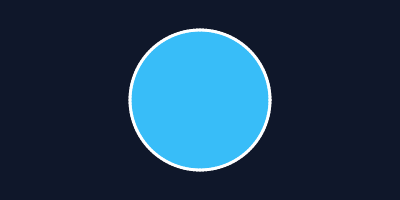

Almost every method returns an image, so operations chain.

### Copying and Mutation

There is one rule in this module that is worth learning before anything
else, because everything else follows from it:

> **Operations that change the image's size return a new image.
> Everything else changes the image in place.**

`resize()`, `crop()`, `rotate()`, `flip()`, `transpose()` and `pad()`
all leave the original untouched and hand back a new one. Drawing,
filters and compositing all modify the image you called them on and
return it so the chain continues.

```zuri
var original = Image.open('photo.jpg')

var small = original.thumbnail(200, 200)   # original is untouched
small.grayscale()                          # small is now grey

echo original.size()                       # still the full size, still colour
```

That means a mixed chain reads correctly, and it means `clone()` is what
you reach for when you want to keep an image before filtering it.

```zuri,ignore
var greyed = photo.clone().grayscale()     # photo keeps its colour
```

## Colours

### Writing a Colour

Anywhere a colour is expected, five spellings are accepted. These are
all the same red:

```zuri,ignore
image.fill(Color(255, 0, 0))
image.fill('#ff0000')
image.fill('red')
image.fill(0xFF0000FF)
image.fill([255, 0, 0])
```

Hexadecimal strings take all four CSS lengths, with or without the
leading `#`: `#f00`, `#f00c`, `#ff0000`, `#ff0000cc`. Names are the full
CSS Color Level 4 list, matched ignoring case, spaces and hyphens, so
`'Dark Sea Green'` and `'darkseagreen'` are the same colour.

Alpha runs 0 (transparent) to 255 (opaque), as in CSS and PNG.

### The Color Class

`Color` is an immutable value type. Every method that would change one
returns a new colour, so a colour held in a variable is safe to pass
around.

```zuri
import imagine { Color }

var brand = Color.hex('#4f46e5')

brand.r                    # 79
brand.to_hex()             # '#4f46e5'
brand.to_packed()          # 0x4F46E5FF

brand.with_alpha(128)      # half transparent
brand.fade(0.5)            # halves whatever alpha it already had
brand.lighten(20)          # 20 percentage points of HSL lightness
brand.darken(20)
brand.saturate(15)
brand.desaturate(15)
brand.rotate_hue(180)
brand.mix('white', 0.25)   # a quarter of the way to white
brand.invert()
brand.to_grayscale()
```

`over()` flattens a translucent colour against a background, which is
what happens when it is drawn onto something solid:

```zuri
Color(255, 0, 0, 128).over('white')    # '#ff7f7f'
```

### Colour Spaces

Conversions come from the [`colors`](#) module, so the conventions are
the same ones it and CSS use: hue in degrees, everything else in
percentage points from 0 to 100.

```zuri
Color.hsl(240, 100, 50)            # '#0000ff'
Color.hsv(120, 100, 100)           # '#00ff00'
Color.hwb(0, 0, 0)                 # '#ff0000'
Color.cmyk(0, 100, 100, 0)         # '#ff0000'
Color.lab(40.7, 50.6, -79.1)       # perceptually uniform
Color.xyz(0.2, 0.15, 0.7)

brand.to_hsl()      # { h: 243.4, s: 75.4, l: 58.6, a: 255 }
brand.to_hsv()
brand.to_hwb()
brand.to_cmyk()
brand.to_lab()
brand.to_xyz()
```

Lab is the right space for interpolating between two colours when the
intermediate steps need to look evenly spaced to the eye. CMYK here is
the naive conversion with no output profile, so it is right for
generating colours and wrong for predicting a printing press.

### Contrast and Accessibility

```zuri
var background = Color.hex('#1e293b')

background.luminance()                  # 0 to 1, WCAG relative luminance
background.contrast_ratio('#ffffff')    # 1 to 21
background.is_dark()                    # true
background.best_contrast()              # white, since the background is dark
```

WCAG asks for a ratio of at least 4.5 for normal text and 3 for large
text, so `best_contrast()` is the quick way to pick a legible foreground
for a colour you did not choose:

```zuri,ignore
var label = swatch.best_contrast('#ffffff', '#111111')

card.text(20, 20, name, font, label)
```

## Loading and Saving

### Opening an Image

```zuri,ignore
var photo = Image.open('photo.jpg')          # from a path
var photo = Image.open(file('photo.jpg'))    # from an open file
var photo = Image.decode(upload)             # from bytes in memory
```

The format is detected from the contents rather than the name, so a
mislabelled file still opens. When the contents cannot be identified —
TGA carries no signature of its own — `Image.open()` falls back to the
file extension.

`Image.decode()` takes options:

```zuri,ignore
Image.decode(upload, { format: 'png' })   # fail unless it really is a PNG
Image.decode(raw, { orient: false })      # skip EXIF auto-rotation
```

Naming the format explicitly is worth doing when you already know it
from a `Content-Type` or an extension: a file claiming to be a PNG that
is really something else then fails loudly instead of being decoded as
whatever it actually is.

### Checking Before Decoding

An image costs four bytes per pixel once decoded, so a 6000x4000
photograph occupies 96 MB in memory however small its file was. For
anything arriving from outside the program, read the header first:

```zuri,ignore
import imagine
import imagine { Image }

var header = imagine.probe(upload)

if header == nil {
  raise Exception('that is not an image')
}

if header.width * header.height > 40000000 {
  raise Exception('image is too large')
}

var photo = imagine.decode(upload)
```

`probe()` returns `{format, width, height}` or `nil`. It reads only the
header, which costs microseconds where decoding the same file costs tens
of milliseconds. `imagine.detect()` is the same check when you only want
the format name.

### Saving

```zuri,ignore
photo.save('out.png')
photo.save('out.jpg', { quality: 90 })
photo.save('out.dat', { format: 'webp' })   # extension overridden
```

The format comes from the extension unless `format` says otherwise. To
get the bytes instead of a file:

```zuri,ignore
var data = photo.encode('webp')
var data = photo.to_png()
var data = photo.to_jpeg(90)
```

`encode()` with no format uses whatever the image was decoded from,
falling back to PNG for an image built in memory.

### Format Reference

| Format | Read | Write | Alpha | Notes |
|---|---|---|---|---|
| PNG | yes | yes | yes | Lossless. The safe default. |
| JPEG | yes | yes | no | Lossy. Photographs only. |
| WebP | yes | yes | yes | **Written lossless**, so smaller than PNG but larger than a lossy WebP. |
| AVIF | no | yes | yes | Smallest files, slowest to encode. |
| GIF | yes | yes | 1-bit | 256 colours. The only animated format that can be written. |
| BMP | yes | yes | yes | Uncompressed and enormous. |
| TIFF | yes | yes | yes | Common in printing and scanning. |
| TGA | yes | yes | yes | No signature; needs an extension or an explicit format. |
| QOI | yes | yes | yes | Lossless, several times faster than PNG. |
| ICO | yes | yes | yes | Icon container. |
| PNM | yes | yes | no | Trivially simple, trivially large. |
| WBMP | yes | yes | no | One bit per pixel. |

Three entries need explaining.

**AVIF is write-only**: opening one raises `DecodeError`.

**TGA has no magic number**, so it can only be identified by its file
extension or by naming the format outright.

**WebP is written losslessly.** Reading handles both lossy and lossless
WebP, but the encoder here only writes lossless, so `quality` has no
effect on it and a photograph saved as WebP will be larger than one
saved by a tool that can write lossy WebP. For a photograph where size
matters, JPEG or AVIF is the better target; WebP here is a
smaller-than-PNG lossless format with alpha.

Never assume; ask:

```zuri
import imagine

var can = imagine.capabilities()

echo can.decode.contains('png')
echo can.encode.contains('webp')
echo can.animated.contains('gif')
```

```console
true
true
true
```

`decode`, `encode` and `animated` are each a list of format names, so
`contains()` answers the question you actually have.

### Encoding Options

| Option | Formats | Meaning |
|---|---|---|
| `quality` | JPEG, AVIF | 1 to 100. Defaults to 85 for JPEG, 80 for AVIF. |
| `compression` | PNG | `'fast'`, `'default'` or `'best'`. All lossless. |
| `speed` | AVIF, GIF | AVIF 1-10, lower is slower and smaller. GIF 1-30, lower is slower and picks better colours; 15 by default. |
| `background` | JPEG | What transparent pixels are flattened against. Defaults to white. |
| `threshold` | WBMP | The brightness cut, 0 to 255. |

JPEG has no alpha channel, so transparency has to go somewhere on the
way out. It is flattened against `background` rather than silently
dropped, because dropping it turns transparent pixels black:

```zuri,ignore
logo.save('logo.jpg', { background: '#ffffff' })
```

To see the result first, or to choose the colour once and keep it, do it
explicitly:

```zuri,ignore
logo.flatten('#ffffff').save('logo.jpg')
```

### Data URLs

```zuri,ignore
var url = icon.to_data_url('png')
# 'data:image/png;base64,iVBORw0...'
```

Base64 costs a third more bytes than the raw image, so this suits icons
and small graphics rather than photographs.

## Resizing and Reshaping

### Choosing a Resize

There are six, and picking the right one is most of the work:

| Method | Aspect ratio | Enlarges? | Result |
|---|---|---|---|
| `resize(w, h)` | not kept | yes | exactly `w x h`, possibly distorted |
| `scale(factor)` | kept | yes | the same image, scaled |
| `thumbnail(w, h)` | kept | **no** | fits inside the box |
| `fit(w, h)` | kept | yes | fits inside the box |
| `cover(w, h)` | kept | yes | fills the box, cropping the overflow |
| `contain(w, h)` | kept | yes | fits the box, padding the remainder |

`thumbnail()` is the one you usually want for thumbnails, and the
refusal to enlarge is the reason: scaling a small image up to fill a
thumbnail box only makes it blurry. Use `fit()` when you do want it
scaled up.

`cover()` and `contain()` both produce exactly the size asked for. They
differ in what they sacrifice — `cover()` loses part of the image,
`contain()` adds bars:

```zuri,ignore
photo.cover(300, 300)                              # crops to a square
photo.cover(300, 300, { anchor: TOP })             # keeps the top, crops the bottom
photo.contain(300, 300, { background: 'white' })   # letterboxes instead
```

The same 320x180 image asked for a 120x120 result four ways:

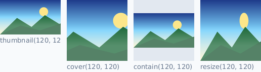

`thumbnail()` keeps the proportions and does not fill the box.
`cover()` fills it and loses the sides. `contain()` fills it and adds
bars. `resize()` fills it by distorting the picture.

The anchors are `TOP_LEFT`, `TOP`, `TOP_RIGHT`, `LEFT`, `CENTER`,
`RIGHT`, `BOTTOM_LEFT`, `BOTTOM` and `BOTTOM_RIGHT`. `CENTER` is the
default, and `TOP` is what you want for photographs of people, where the
face is rarely in the bottom third.

### Resampling Filters

| Filter | Speed | Use |
|---|---|---|
| `NEAREST` | fastest | Pixel art, QR codes, anything whose edges must stay hard. |
| `BILINEAR` | fast | When speed matters more than sharpness. |
| `BICUBIC` | moderate | A good default for photographs. |
| `GAUSSIAN` | moderate | Deliberately soft; for noisy input, or before sharpening. |
| `LANCZOS` | slowest | Thumbnails and any large reduction. The default. |

```zuri,ignore
photo.thumbnail(200, 200, LANCZOS)
sprite.scale(4, NEAREST)             # keeps pixel art crisp
```

A 16x16 sprite enlarged seven times over, so the differences are
visible at all:

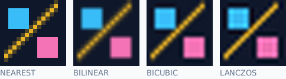

This is the case where `NEAREST` is right and everything else is
wrong. Shrinking a photograph inverts that judgement entirely.

`LANCZOS` is the default because most resizing is shrinking, and that is
where it earns its cost. It can produce faint ringing next to very
high-contrast edges, which is the price of its sharpness; `BICUBIC` is
the fallback when that shows.

### Cropping, Padding and Trimming

```zuri,ignore
photo.crop(100, 50, 400, 300)      # x, y, width, height
photo.pad(20)                      # 20 pixels on every side
photo.pad(10, 20, 10, 20, 'white') # top, right, bottom, left, colour
photo.trim()                       # remove a uniform border
photo.trim({ tolerance: 8 })       # allow for JPEG noise in the border
```

`crop()` requires its rectangle to fit inside the image and raises
`BoundsError` otherwise. Clamping a crop that runs off the edge would
hand back different dimensions than were asked for, which is a worse
surprise than an error. Pad first when the region really is meant to
extend past the edge.

`trim()` takes the border colour from the top-left pixel unless you name
one. Scanned documents and screenshots almost always want a tolerance,
because a "white" border from a lossy format is not exactly white.

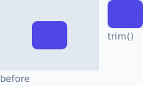

### Rotating and Mirroring

```zuri,ignore
photo.rotate_90()                  # lossless
photo.rotate_180()
photo.rotate_270()
photo.rotate(37, 'white')          # resamples, grows the canvas

photo.flip_horizontal()
photo.flip_vertical()
photo.flip(FLIP_BOTH)
photo.transpose()                  # reflect across the main diagonal
```

Quarter turns are exact: every pixel is moved, none is resampled. Any
other angle interpolates, and grows the canvas to hold the rotated
corners with `background` filling the gaps.

### EXIF Orientation

Phone cameras usually store the sensor's orientation in the file rather
than rotating the pixels, so a photograph whose bytes are sideways is
meant to be displayed upright. `Image.open()` and `Image.decode()`
handle this for you.

```zuri
Image.open('photo.jpg')                       # upright
Image.open('photo.jpg', { orient: false })    # exactly as stored
```

All eight orientation values are handled, including the four mirrored
ones that scanners and some front-facing cameras produce.

## Filters

Filters change the image in place and return it, so they chain.

```zuri,ignore
photo.grayscale().contrast(15).sharpen(0.5)
```

### Tone and Exposure

```zuri,ignore
photo.brightness(20)         # -255 to 255, added to each channel
photo.contrast(15)           # -100 to 100, around mid-grey
photo.gamma(1.2)             # above 1 lifts midtones, below 1 lowers them
photo.levels(20, 235)        # stretch this input range to full scale
photo.levels(20, 235, 1.1)   # ...with a midtone curve
photo.threshold(128)         # every pixel to black or white
photo.posterize(6)           # six evenly spaced steps per channel
photo.invert()               # a photographic negative
photo.opacity(0.5)           # scale the alpha channel
```

`levels()` is the single most useful correction for a flat or
washed-out photograph. Everything at or below the black point becomes
black, everything at or above the white point becomes white, and the
range between is stretched to fill the scale.

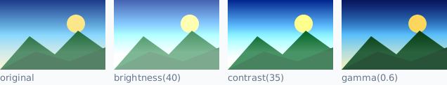

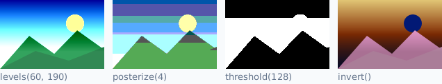

Note the difference between `posterize()` and `quantize()`:
`posterize()` spaces its levels evenly, `quantize()` picks the colours
to suit the image, so a photograph survives far fewer of them.

```zuri,ignore
photo.quantize(32)                # 32 well-chosen colours
photo.quantize(16, true)          # ...with dithering
```

`auto_levels()` does the same job as `levels()` without being told
where the endpoints are; it is shown alongside the detail filters
below.

### Colour

```zuri,ignore
photo.grayscale()
photo.sepia()
photo.saturate(1.4)               # 0 removes colour, 1 is unchanged
photo.hue_rotate(45)
photo.tint('#ff8800', 0.3)        # blend a flat colour in
photo.colorize('#4f46e5')         # monochrome in one colour
photo.duotone('#1e1b4b', '#fbbf24')
photo.flatten('white')            # composite over a colour, drop alpha
```

`grayscale()` weights the channels for perceived brightness, so a bright
yellow comes out light and a deep blue comes out dark. That is different
from `saturate(0)`, which keeps HSL lightness and makes both mid-grey.

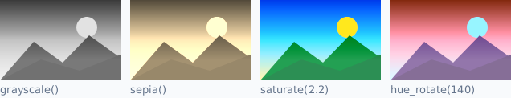

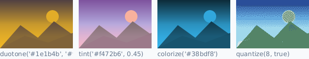

### Blur, Sharpen and Detail

```zuri,ignore
photo.blur(3)                # Gaussian; the argument is its sigma
photo.sharpen(0.8)
photo.smooth()               # a cheap, harsher 3x3 average
photo.emboss()
photo.edges()
photo.mean_removal()
photo.pixelate(12)
```

`blur()` is a true separable Gaussian, so a large radius costs linearly
rather than quadratically. Its argument is the standard deviation: about
two thirds of each pixel's contribution falls within that distance, and
the visible spread is roughly three times it.

Alpha is premultiplied for the duration of a blur, so blurring a shape
on a transparent background does not drag a dark halo into its edge.

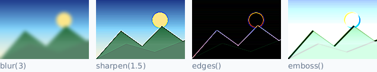

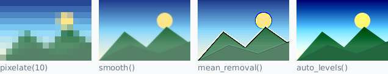

### Writing Your Own Filter

Nearly every filter above is one of three primitives with different
numbers in it, and all three are available directly.

**A lookup table** covers any per-channel tone curve. The table is built
once whatever the image's size, then applied at memory speed.

```zuri,ignore
import imagine { filters }

# A gentle S-curve: more contrast, but the highlights survive.
var curve = filters.build_lut(@(value) {
  var t = value / 255
  return 255 * t * t * (3 - 2 * t)
})

photo.apply_lut(curve, curve, curve, nil)   # nil leaves alpha alone
```

**A colour matrix** covers anything that mixes channels — saturation,
hue rotation, channel swaps, tinting. It is the 4x5 matrix SVG and CSS
filters use, written row by row, with the last entry of each row a
constant in 0-255 units.

```zuri,ignore
# Swap the red and blue channels.
photo.apply_matrix([
  0, 0, 1, 0, 0,
  0, 1, 0, 0, 0,
  1, 0, 0, 0, 0,
  0, 0, 0, 1, 0,
])
```

Applying several matrices in a row is both slower and less accurate than
combining them and applying the result once:

```zuri,ignore
var both = filters.combine_matrices(
  filters.grayscale_matrix(),
  filters.saturation_matrix(1.2)
)

photo.apply_matrix(both)
```

**A convolution kernel** covers anything that reads a pixel's
neighbours.

```zuri,ignore
photo.convolve([
  0, -1, 0,
  -1, 5, -1,
  0, -1, 0,
])
```

The kernel must be square with an odd side. The default divisor of 0
means "divide by the kernel's own sum", which is what nearly every
published kernel expects.

One trap is worth knowing. Alpha goes through the kernel along with the
colour channels, which is right for a blur and wrong for anything whose
weights do not sum to one. A Laplacian over a uniformly opaque image
sums to zero, which would make the whole result invisible:

```zuri,ignore
photo.convolve(filters.edge_kernel(), { divisor: 1, keep_alpha: true })
```

The built-in `edges()`, `emboss()`, `sharpen()` and `mean_removal()`
already do this.

The S-curve and the channel-swap matrix from this section, run against
the same picture:

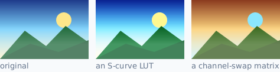

`edge` controls what happens off the image's border: `EDGE_CLAMP` (the
default) repeats the nearest edge pixel, `EDGE_TRANSPARENT` treats the
outside as empty, and `EDGE_WRAP` wraps to the opposite side for images
meant to tile.

## Drawing

### Shapes

Coordinates start at the top-left corner. Integer coordinates fall on
pixel corners rather than centres, so a rectangle from (0, 0) to
(10, 10) covers exactly the first ten pixels in each direction.

```zuri,ignore
image.pixel(x, y, color)                        # one pixel, blended
image.line(x1, y1, x2, y2, color)
image.rect(x, y, w, h, color)                   # outline
image.fill_rect(x, y, w, h, color)
image.rounded_rect(x, y, w, h, radius, color)
image.fill_rounded_rect(x, y, w, h, radius, color)
image.circle(cx, cy, r, color)
image.fill_circle(cx, cy, r, color)
image.ellipse(cx, cy, rx, ry, color)
image.fill_ellipse(cx, cy, rx, ry, color)
image.arc(cx, cy, rx, ry, start, end, color)
image.pie(cx, cy, rx, ry, start, end, color)    # closed through the centre
image.chord(cx, cy, rx, ry, start, end, color)  # closed along the chord
image.bezier(x1, y1, cx1, cy1, cx2, cy2, x2, y2, color)
```

Angles are in degrees, measured clockwise from three o'clock, matching
the direction the y axis runs.

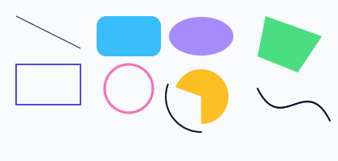

Drawing outside the image is never an error; anything that falls outside
is clipped away. That is what makes it safe to draw a shape that only
partly overlaps.

### Strokes and Anti-aliasing

```zuri,ignore
image.thickness(4)         # applies to every subsequent stroke
image.antialias(false)     # hard edges
```

Both are settings on the image rather than per-call arguments, though a
single call can override the thickness:

```zuri,ignore
image.line(0, 0, 100, 100, 'black', { thickness: 8 })
```

Strokes are centred on the path, so a thickness of 4 puts 2 pixels on
each side. Joints and the ends of an open path are rounded.

Anti-aliasing is on by default. Turn it off for output that has to be
pixel-exact — barcodes, QR codes, anything that will be thresholded
afterwards.

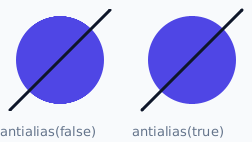

Stroke widths of 1, 3, 6 and 12:

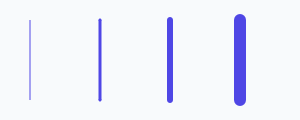

### Line Caps

How an open stroke finishes at its two ends is a separate choice from
its width:

```zuri,ignore
image.cap(CAP_ROUND)     # a half-disc. The default.
image.cap(CAP_SQUARE)    # a square, reaching the same distance
image.cap(CAP_BUTT)      # stops dead at the endpoint
```

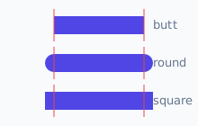

The red marks are the exact coordinates the line was given. A round or
square cap reaches half the stroke's width past them; a butt cap does
not.

`CAP_BUTT` is the one to reach for whenever the coordinates have to
mean exactly what they say — segments meeting end to end, a scale bar
of a known length, the pieces of a dashed line. `CAP_SQUARE` gives the
same reach as round with a blunt finish.

A single call can override the surface's setting:

```zuri,ignore
image.line(40, 200, 40, 40, '#334155', { thickness: 6, cap: CAP_BUTT })
```

Joins *between* a path's segments are always round, and closed outlines
have no ends, so neither is affected by this.

### Paths and Polygons

Every filled shape in this module becomes a polygon and goes through one
scanline rasterizer, and every outline becomes the polygon around its
stroke and goes through the same one. A shape not listed above can be
drawn by supplying the points:

```zuri,ignore
image.fill_polygon([[10, 10], [90, 30], [50, 80]], '#4f46e5')
image.polygon([[10, 10], [90, 30], [50, 80]], 'black')     # outline, closed
image.polyline([[10, 10], [90, 30], [50, 80]], 'black')    # not closed
```

Points may be a list of `[x, y]` pairs or a flat list of alternating
values; both read naturally depending on where the points came from.
The outline is closed for you, so the last point does not need to repeat
the first.

Self-intersecting outlines are filled by the non-zero winding rule,
which fills a five-pointed star solid. Pass `{ even_odd: true }` for the
other convention, which leaves its middle empty.

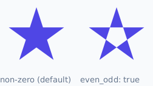

### Filling Areas

```zuri,ignore
image.fill('#0f172a')          # every pixel, ignoring the clip
image.clear()                  # every pixel to transparent
image.flood_fill(x, y, color)
image.flood_fill(x, y, color, 12)   # with a tolerance
```

Gradients get [their own section](#gradients) below.

`fill()` replaces rather than blends, so filling with a transparent
colour empties the image instead of leaving it unchanged.

Flood fill spreads four-connected — up, down, left and right, but not
diagonally — through pixels within `tolerance` of the colour at the
starting point. A tolerance of 0 spreads only through exactly equal
pixels; on a photograph or anything anti-aliased you will want more.

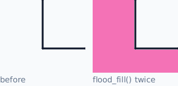

### Gradients

```zuri,ignore
image.linear_gradient(x1, y1, x2, y2, stops)
image.radial_gradient(cx, cy, radius, stops)
```

A linear gradient runs along the vector from the first point to the
second. Everything before that vector takes the first stop's colour and
everything past it takes the last stop's, so a short vector across a
large area gives a hard transition with flat bands on either side.

```zuri,ignore
# top to bottom
image.linear_gradient(0, 0, 0, image.height(), ['#0f172a', '#334155'])

# diagonal, three colours
image.linear_gradient(0, 0, 400, 200, ['#4f46e5', '#f472b6', '#fbbf24'])
```

Stops are either bare colours, spaced evenly, or `[offset, colour]`
pairs with the offset running 0 to 1:

```zuri,ignore
image.linear_gradient(0, 0, 200, 0, [
  [0, 'black'],
  [0.25, 'red'],
  [1, 'white'],
])
```

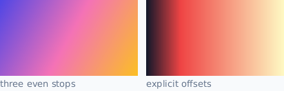

By default a gradient replaces what is there. Pass `{ blend: true }` to
composite it instead, which is what makes overlays and vignettes work:

```zuri,ignore
# a vignette over an existing photograph
photo.radial_gradient(
  photo.width() / 2,
  photo.height() / 2,
  photo.width() * 0.7,
  [[0, Color(0, 0, 0, 0)], [1, Color(0, 0, 0, 180)]],
  { blend: true }
)

# a caption scrim along the bottom
photo.linear_gradient(0, photo.height() - 120, 0, photo.height(), [
  Color(0, 0, 0, 0),
  Color(0, 0, 0, 200),
], { blend: true })
```

`{ rect: {x, y, width, height} }` confines the fill to a rectangle
instead of covering the whole surface.

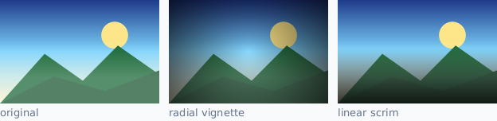

Both of those are the snippets above, run against the picture on the
left.

### Clipping

```zuri,ignore
image.clip(20, 20, 100, 100)
image.fill_rect(0, 0, 500, 500, 'red')   # only the clip is painted
image.clear_clip()
```

A clip confines every drawing operation until it is cleared. It does not
affect reading: `get_pixel()` sees the whole image either way.

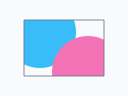

## Text

### The Built-in Font

`imagine` ships no font file, so everything in the next section
depends on what is installed on the machine and can fail. One font
always works:

```zuri
import imagine { Image, StrokeFont }

Image(300, 70, 'white')
  .text(16, 20, 'Always available', StrokeFont(28), '#0f172a')
  .save('label.png')
```

`Font.builtin(size)` is the same thing under a name you will find from
`Font`.

It is not a font file. Every glyph is defined as geometry — centre-line
strokes rather than filled outlines — in
[`libs/imagine/strokefont.zu`](https://github.com/zuri-lang/zuri/blob/main/libs/imagine/strokefont.zu), and
drawn through the same anti-aliased rasterizer as everything else. So
it scales cleanly to any size, and its weight is a parameter rather
than part of the design:

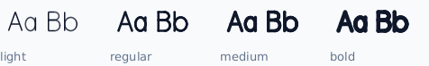

```zuri
StrokeFont(24)              # regular
StrokeFont(24).weight(0.13) # bold
StrokeFont(24).weight(0.05) # light
```

Here is the whole thing:

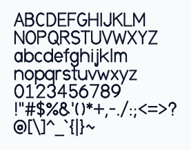

**What it is for.** Labels, chart axes, watermarks, diagrams,
placeholder text, and any output that has to work on a machine with no
fonts installed. The look is geometric and single-weight, closer to a
technical drawing than to a typeface, because that is what centre-line
strokes give you honestly.

**What it is not for.** Body text, headlines, or anything where the
shapes themselves matter. Load a real font for those.

**Coverage** is printable ASCII, from space through `~`. Anything else
draws the empty box a font uses for a glyph it does not have, so text
in another script comes out visibly missing rather than silently blank.

A `StrokeFont` has the same interface as a `Font` — `size()`,
`metrics()`, `measure()`, `render()`, `wrap()` — so anywhere a font is
accepted, either works.

### Loading a Font

```zuri,ignore
import imagine { Font }

var font = Font.load('assets/Inter.ttf', 24)
var font = Font.from_bytes(embedded_font, 24)
var font = Font.system('DejaVu Sans', 24)
var font = Font.sans(24)
```

`Font.load()` reads a TrueType or OpenType file and caches the parsed
face by path, so loading the same file twice in one process parses it
once. `Font.system()` searches the platform's font directories by family
name, matching ignoring case, spaces and hyphens.

`Font.sans()` finds whichever common sans-serif font is installed. It is
a convenience for scripts and tests, not something to rely on for output
that must look the same everywhere: which font it lands on depends on
the machine, and a container image with no fonts installed has none to
find. It raises `FontError` in that case, pointing at
`Font.builtin()`, which never depends on what is installed.

A `Font` is immutable and cheap to copy. `size()` returns the same face
at another size, sharing the parsed data:

```zuri,ignore
var title = font.size(32)
var body = font.size(14)
```

### Drawing Text

```zuri,ignore
image.text(20, 20, 'Hello', font, '#111111')
```

`x` and `y` are the top-left corner of the text's box, not its baseline,
because the corner is what you know when placing text in a layout. Pass
`{ baseline: true }` when you want `y` to mean the first line's
baseline instead.

A `\n` starts a new line.

```zuri,ignore
card.text(24, 24, 'Quarterly report\n2026', title, '#111111', {
  align: ALIGN_CENTER,
  line_height: 1.4,
  tracking: 0.5,
})
```

`align` positions the lines against each other, not against the image.
`line_height` is a multiplier on the font's own recommended spacing, and
`tracking` adds pixels between characters.

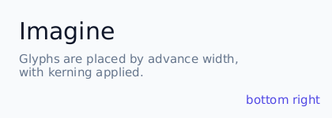

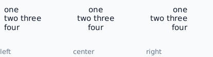

### Measuring and Positioning

```zuri,ignore
var box = image.text_size('Hello', font)
# { width: 58, height: 28, baseline: 22.3, lines: 1 }
```

Measuring costs a fraction of drawing, so it is the right way to lay
text out before committing to it — centring, wrapping, or sizing a
background to fit.

```zuri,ignore
var box = card.text_size(label, font)

card.fill_rounded_rect(16, 16, box.width + 24, box.height + 16, 8, '#1e293b')
card.text(28, 24, label, font, 'white')
```

To position by anchor instead of coordinates:

```zuri,ignore
card.place_text('SOLD OUT', font, 'white', CENTER)
card.place_text('v2.1', font, '#94a3b8', BOTTOM_RIGHT, { margin: 12 })
```

### Wrapping

```zuri,ignore
var body = Font.load('assets/Inter.ttf', 16)

page.text(40, 120, article, body, '#334155', { width: 520 })
```

The `width` option wraps the text to that many pixels before drawing
it. `text_size()` takes the same option, so measuring wrapped text
gives the box it will actually occupy.

To get the broken text itself — to store it, or to draw it in pieces —
call `wrap()` on the font:

```zuri,ignore
var lines = body.wrap(article, 520).split('\n')

echo '${lines.length()} lines'
```

Newlines already in the text are kept as paragraph breaks, and runs of
spaces are collapsed. Words are kept whole where they can be; a single
word too long for the width is broken between characters rather than
allowed to overflow, since text spilling out of an image cannot be
scrolled to.

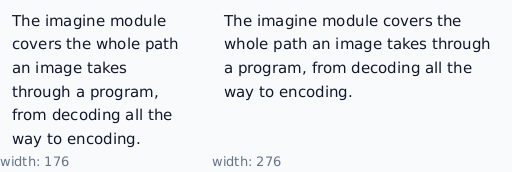

### What Text Layout Does Not Do

Glyphs are positioned by advance width with kerning applied. That covers
Latin, Greek, Cyrillic and anything else written left to right without
contextual shaping.

It does not do complex shaping. Arabic letters will not join, Indic
clusters will not reorder, and ligatures are not substituted. Those need
a shaping engine, and a standard library that pretended to do them would
be worse than one that says plainly it does not.

## Compositing

### Drawing One Image Onto Another

```zuri,ignore
photo.draw_image(logo, 20, 20)
photo.draw_image(logo, 20, 20, { opacity: 0.6 })
photo.place(logo, BOTTOM_RIGHT, { margin: 16, opacity: 0.5 })
```

The source is clipped to the destination, and its position may be
negative, so a sprite hanging off the top-left corner draws correctly.
Compositing an image onto itself works; it is copied first.

### Blend Modes

```zuri,ignore
photo.draw_image(texture, 0, 0, { blend: BLEND_MULTIPLY })
```

| Mode | Effect |
|---|---|
| `BLEND_NORMAL` | Ordinary alpha compositing. The default. |
| `BLEND_MULTIPLY` | Never lighter than either input. Shadows. |
| `BLEND_SCREEN` | Never darker than either input. Glows. |
| `BLEND_OVERLAY` | Multiply in the shadows, screen in the highlights. |
| `BLEND_DARKEN` / `BLEND_LIGHTEN` | Keep the darker or lighter channel. |
| `BLEND_COLOR_DODGE` / `BLEND_COLOR_BURN` | Strong brighten or darken. |
| `BLEND_HARD_LIGHT` / `BLEND_SOFT_LIGHT` | Overlay with the roles swapped; and a gentler version. |
| `BLEND_DIFFERENCE` / `BLEND_EXCLUSION` | Absolute difference; and a lower-contrast variant. |
| `BLEND_ADD` / `BLEND_SUBTRACT` | Add or subtract, clamped. |

The formulas are the ones in the CSS compositing specification, which is
also what every image editor implements.

`BLEND_DIFFERENCE` makes a quick visual diff: identical images blended
this way come out black.

A red circle drawn onto a gradient under eight of the modes:

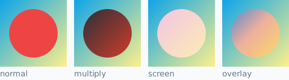

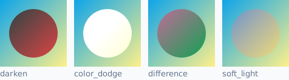

```zuri,ignore
var diff = before.clone().draw_image(after, 0, 0, { blend: BLEND_DIFFERENCE })
```

Drawing operations — lines, shapes, text — always use ordinary alpha
compositing. To draw a shape under a blend mode, draw it on a layer and
composite the layer.

### Masks

```zuri,ignore
var stencil = photo.layer()
stencil.fill_circle(200, 200, 150, 'white')

photo.mask(stencil)     # everything outside the circle becomes transparent
```

Each pixel keeps its colour and takes its transparency from the mask:
opaque white shows the image through fully, black or transparent hides
it, and greys give partial transparency. The mask's own alpha counts, so
a shape drawn on a transparent background works as a mask without being
filled in first.

The mask must be the same size as the image.

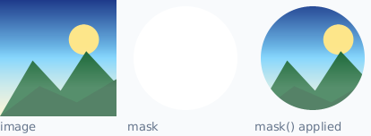

### Layers

`layer()` gives a transparent image of the same size. Building a
composite out of layers is how you get effects that a single pass
cannot, and it is the answer whenever you want a blend mode or an
opacity applied to a group of operations rather than one:

```zuri,ignore
var glow = photo.layer()

glow.fill_circle(200, 150, 80, '#fbbf24')
glow.blur(30)

photo.draw_image(glow, 0, 0, { blend: BLEND_SCREEN, opacity: 0.7 })
```

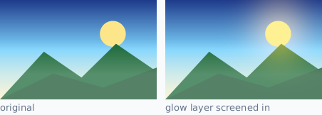

## Inspecting an Image

```zuri,ignore
photo.width()          # dimensions
photo.height()
photo.size()           # { width, height }
photo.bounds()         # { x: 0, y: 0, width, height }
photo.format()         # what it was decoded from, or nil
photo.is_opaque()      # walks the alpha channel
photo.info()           # all of the above, plus a pixel count
```

Beyond the shape, four methods read what is actually in the image.

**`histogram()`** counts how many pixels hold each value, as four
256-entry lists: `red`, `green`, `blue` and `luma`. Fully transparent
pixels are skipped, since their colour is not visible. A histogram is
what tells you an image is underexposed (everything bunched at the low
end), flat (bunched in the middle), or clipped (a spike at 0 or 255).

**`auto_levels()`** is the automatic form of `levels()`: it finds the
black and white points from the brightness histogram and stretches the
range between them, ignoring a small fraction at each end so a handful
of stray pixels cannot decide the result.

```zuri,ignore
photo.auto_levels()
photo.auto_levels({ clip: 0.02, gamma: 1.1 })
```

**`average_color()`** returns the mean colour, weighting each pixel by
its alpha so a mostly transparent image reports the colour of the part
you can see.

**`dominant_colors()`** returns the colours occupying the most of the
image, most common first. The image is shrunk and reduced to a small
palette first, so it costs about the same whatever the original size.

```zuri,ignore
var accent = photo.dominant_colors(1)[0]

page.fill(accent.darken(40))       # a placeholder while the photo loads
```

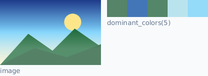

**`difference()`** scores how far two images are apart, from 0
(identical) to 1, which makes it usable as a rendering assertion:

```zuri,ignore
if rendered.difference(expected) > 0.01 {
  raise Exception('the rendering changed')
}
```

## Animation

```zuri,ignore
import imagine { Animation }

var animation = Animation.open('loading.gif')

animation.length()      # frame count
animation.duration()    # milliseconds for one pass
animation.frame(0)      # one frame, as an Image
animation.frames()      # the live list
```

Frames come back already composited against whatever preceded them, so
frame 5 can be used on its own without replaying the first four. The
disposal and transparency rules an animated GIF is built from never
surface.

Building and transforming:

```zuri,ignore
var frames = []

iter var i = 0; i < 30; i++ {
  var frame = Image(200, 200, 'black')
  frame.fill_circle(100, 100, i * 3, '#38bdf8')
  frames.append(frame)
}

Animation(frames, 40, 0).save('pulse.gif')     # 40ms per frame, loops forever
```

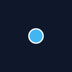

```zuri,ignore
animation
  .map(@(frame) {
    return frame.grayscale().blur(1)
  })
  .repeat(3)
  .save('out.gif')
```

`map()` copies each frame before the function sees it, so a filter chain
works directly as the body and the original animation is left alone.
That copy is why `map()` costs as much memory again as the animation
itself; to filter in place, walk `frames()` and change each image
directly.

Animated GIF and animated WebP can both be read, and only GIF can be
written. A still image decodes as a one-frame animation rather than an
error, so code handling both does not need to branch.

Every frame must be the same size, since animated formats have one
canvas that each frame paints into.

## Working With Pixels Directly

`pixels()` hands back the live buffer. It is 8-bit RGBA with straight
(not premultiplied) alpha, laid out row by row with no padding, so pixel
`(x, y)` begins at byte `(y * width + x) * 4`.

```zuri,ignore
var buffer = image.pixels()
var total = buffer.length()

iter var at = 0; at < total; at += 4 {
  buffer[at] = 255 - buffer[at]        # invert red only
}
```

This is deliberate, and it is much faster than a method call per pixel,
so an operation this module does not provide can still be written
efficiently in Zuri. Annotating a function's parameters pays off here:

```zuri
def darken_edges(pixels: bytes, width: number, height: number) {
  iter var y = 0; y < height; y++ {
    iter var x = 0; x < width; x++ {
      var at = (y * width + x) * 4
      # ...
    }
  }
}
```

`set_pixels()` takes a buffer back, which is how you save a copy before
a destructive filter and restore it afterwards:

```zuri,ignore
var saved = image.pixels().clone()

image.blur(8)
image.set_pixels(saved)     # back where it started
```

`Image.from_pixels()` builds an image around a buffer that came from
somewhere else entirely.

## Errors

Failures fall into two groups. An argument of the wrong *type* raises
`TypeError`, from the parameter's own type declaration. Everything else
descends from `ImageError`, so one catch covers it:

```zuri
import imagine { Image, ImageError, DecodeError }

catch {
  var photo = Image.open(path)
} as e {
  if instance_of(e, DecodeError) {
    echo 'not a readable image'
  } else {
    echo 'something else went wrong: ${e.message}'
  }
}
```

| Error | Raised when |
|---|---|
| `ImageError` | The base class. Also raised directly for bad arguments. |
| `DecodeError` | The data is not an image, is a format this build cannot read, or is truncated. |
| `EncodeError` | The image cannot be written in the requested format. |
| `FormatError` | A format name or file extension is not one this module knows. |
| `BoundsError` | A rectangle, crop or resize falls outside the image, or a dimension is below 1. |
| `FontError` | A font cannot be parsed, found, or laid out with. |

Two kinds of failure sit outside that hierarchy on purpose.

**Wrong argument type raises `TypeError`.** Parameters declare their
types, so the check happens at the boundary and the message names the
parameter:

```zuri,ignore
image.rotate('sideways')
# TypeError: rotate() expects parameter 'degrees' (argument 1)
#            to be a number, got string
```

**A malformed colour raises `ValueError`**, because that is what
[[colors]] reports for it and relabelling would lose the distinction
between "not a colour" and "not a string":

```zuri,ignore
Color.hex('nonsense')        # ValueError, from colors
Color.named('chartroose')    # ValueError, from colors
Color.hex(42)                # TypeError, from the type declaration
```

A value of the right type but the wrong *range* is still an
`ImageError` subclass, since that is a judgement this module makes
rather than a type the runtime can check:

```zuri,ignore
Image(0, 100)                # BoundsError, not TypeError
filters.gamma_lut(-1)        # ImageError
```

`DecodeError` is the one to always be ready for, since anything arriving
from outside the program can raise it.

Drawing operations do not raise `BoundsError`. A line running off the
edge of the canvas is clipped, which is what every drawing API does; it
is only the operations that must return an image of an exact size that
have no sensible way to continue.

## Performance and Memory

Four bytes per pixel, always. A 6000x4000 photograph is 96 MB decoded
however small its file was, and a 100-frame 500x500 animation is 100 MB.
`probe()` before decoding anything whose size you do not control.

Some rough guidance on what costs what:

- **Decoding and encoding** dominate almost every pipeline. PNG at
  `'best'` compression is several times slower than at `'default'` for a
  few percent of size; AVIF is slower still.
- **Resizing** costs roughly in proportion to the *output* size, so
  shrinking is cheap and enlarging is not. `LANCZOS` costs a few times
  `NEAREST`.
- **Blur** is linear in its radius, not quadratic, because it is
  separable. A 3x3 `convolve()` is cheaper than `blur(1)`, but by
  `blur(5)` the Gaussian has won by a wide margin.
- **Lookup tables and colour matrices** are memory-bound and about as
  fast as touching every pixel can be. Chain as many as you like, but
  combine matrices with `combine_matrices()` rather than applying them
  one at a time — that is both faster and more accurate, since the
  intermediate result is never rounded back to 8 bits.
- **Drawing** costs in proportion to the area covered, and
  anti-aliasing samples each pixel row four times over. Turning it off
  is a real saving on very large fills.

Resize before filtering whenever the result is going to be smaller
anyway. Filtering a 24-megapixel photograph and then shrinking it to a
thumbnail does the same visual work at forty times the cost.

## Recipes

**A thumbnail pipeline for uploads**

```zuri
import imagine
import imagine { Image, DecodeError, LANCZOS, TOP }

def make_thumbnail(upload) {
  var header = imagine.probe(upload)

  if header == nil {
    raise DecodeError('not an image')
  }

  if header.width * header.height > 50000000 {
    raise DecodeError('image too large')
  }

  return Image.decode(upload)
    .cover(400, 400, { anchor: TOP, filter: LANCZOS })
    .sharpen(0.4)
    .encode('webp')
}
```

**A rounded avatar with a border**

```zuri
import imagine { Image }

def avatar(source, size) {
  var photo = Image.decode(source).cover(size, size)

  var stencil = photo.layer()
  stencil.fill_circle(size / 2, size / 2, size / 2 - 2, 'white')
  photo.mask(stencil)

  photo.circle(size / 2, size / 2, size / 2 - 2, '#e2e8f0', { thickness: 3 })

  return photo
}
```


**A social card**

```zuri
import imagine { Image, Font, Color, ALIGN_LEFT }

def card(title, subtitle) {
  var image = Image(1200, 630, '#0f172a')
  var heading = Font.load('assets/Inter-Bold.ttf', 64)
  var body = heading.size(30)

  image.fill_rect(0, 0, 1200, 8, '#38bdf8')

  var box = image.text_size(title, heading, { align: ALIGN_LEFT })
  image.text(80, 200, title, heading, 'white', { align: ALIGN_LEFT })
  image.text(80, 200 + box.height + 24, subtitle, body, '#94a3b8')

  return image.to_png()
}
```

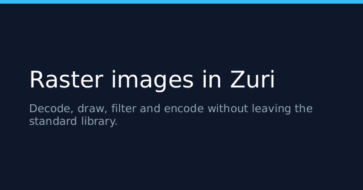

**Serving a generated image over HTTP**

```zuri,ignore
import http
import imagine { Image, Font, CENTER }
import imagine.formats

var server = http.server(8000)
var font = Font.load('assets/Inter.ttf', 20)

server.get('/badge/{label}', @(request, response) {
  var image = Image(220, 60, '#1e293b')

  image.fill_rounded_rect(0, 0, 220, 60, 8, '#334155')
  image.place_text(request.param('label'), font, 'white', CENTER)

  response.content_type(formats.mime_for('png'))
  response.cache_for(86400)
  response.write(image.to_png())
})

server.listen()
```

**Comparing two images**

```zuri
import imagine { BLEND_DIFFERENCE }

def differs(a, b) {
  if a.size() != b.size() {
    return true
  }

  var diff = a.clone().draw_image(b, 0, 0, { blend: BLEND_DIFFERENCE })
  var pixels = diff.pixels()
  var total = pixels.length()

  iter var at = 0; at < total; at += 4 {
    if pixels[at] > 8 or pixels[at + 1] > 8 or pixels[at + 2] > 8 {
      return true
    }
  }

  return false
}
```
